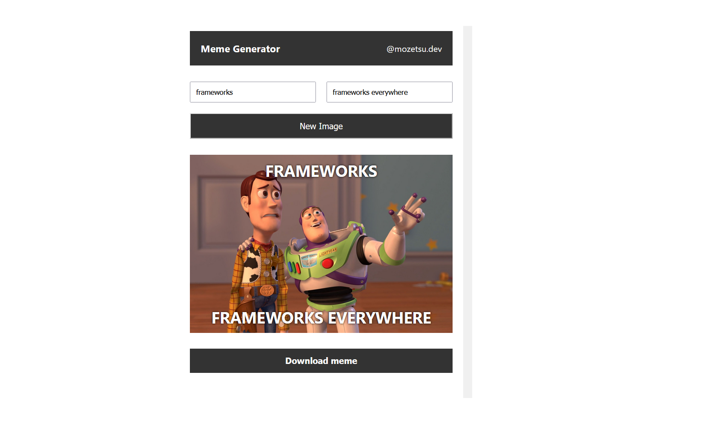

# Meme Generator that consumes external API
Project built from scratch to test my knowledge in React.

  

## Objective
Build a web application where users can generate memes. It should be built without entirely fro scratch. Users should be greeted with a form where they can input text for both the top section of the meme as well as the bottom one. Users can type the meme text in inputs of the form and it should be placed on top of the image every time the value of any input changes. Images should be retrieved from an external API and rendered to the screen. A button to get a random new image should be provided.

## Stack
 - Vite
 - React

## Features
- Ability to input text to be placed on the image;
- Retrieve images from external API source;
- Controlled forms using useState hook;
- Render new image on app load using useEffect hook;
- Download image;

## Development
Used [Vite](https://vitejs.dev/) to generate the boilerplate code as it is getting a lot of attention lately. I personally love the build speed to setup new projects. The difference becomes extremely evident when compared to the well known [create-react-app](https://create-react-app.dev/) alternative.

The project is fairly simple as I was looking to consolidate my concepts of React. I sticked to a simple app where I could focus more on the code rather than the UI/UX. Created three separate components (Header, Form, and Image), each residing in its own folder of same name. By allocating each component into its own separate folder it became extremely easy to manage related files, such as css files.

Used state in the App component to handle both the data fetched from the external API, as well as the data the user created using the form. Used an array state to store all the different instances of data provided by the API. This allowed me to iterate throught the array whenever I needed to get a new image Url. Also used an object state to store the current meme data such as text provided by the user and the image Url. Whenever the values of inputs changed, this state is updated and the values stored are then passed to the input elements, creating controlled forms.

## Conclusion
This project gave me confidence as it proved I could not only build React applications, but also how to properly structure a project in a way that is more efficient to work with components. Moreover, I felt comfortable handling the data flow using hooks and felt little to no difficulty when had to move events between components throughout the development process.
